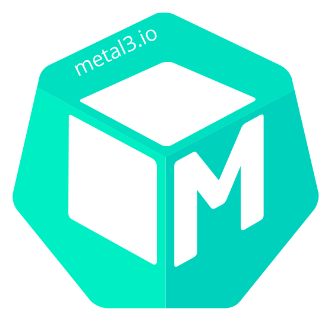

<<<<<<< HEAD
# Metal³

=======

    

# Metal³
>>>>>>> 618ec465a93ca4fd6974f71fb9bd88546ec0f2ad

Metal³ project (pronounced: Metal Kubed) exists to provide components
that allow you to do bare metal host management for Kubernetes. Metal³
works as a Kubernetes application, meaning it runs on Kubernetes and is
managed through Kubernetes interfaces.

Metal³ is one of the providers for the Kubernetes sub-project [Cluster
API](https://github.com/kubernetes-sigs/cluster-api) and is focused on
providing Kubernetes native APIs to manage Kubernetes clusters in a bare
<<<<<<< HEAD
metal environment.

## Why another provisioning tool?

## Metal³ Community

If you are interested in Metal³, please join our bi-weekly community meetings.

### Meeting notes

Anyone is welcome to add a discussion topic in the agenda before the meeting
starts. To be able to add a discussion topic in the meeting notes, you need
to gain a write permission to the [google docs](https://docs.google.com/document/d/1d7jqIgmKHvOdcEmE2v72WDZo9kz7WwhuslDOili25Ls/edit)
by joining to [metal3 development list](https://groups.google.com/g/metal3-dev).
=======
metal environment.
>>>>>>> 618ec465a93ca4fd6974f71fb9bd88546ec0f2ad
